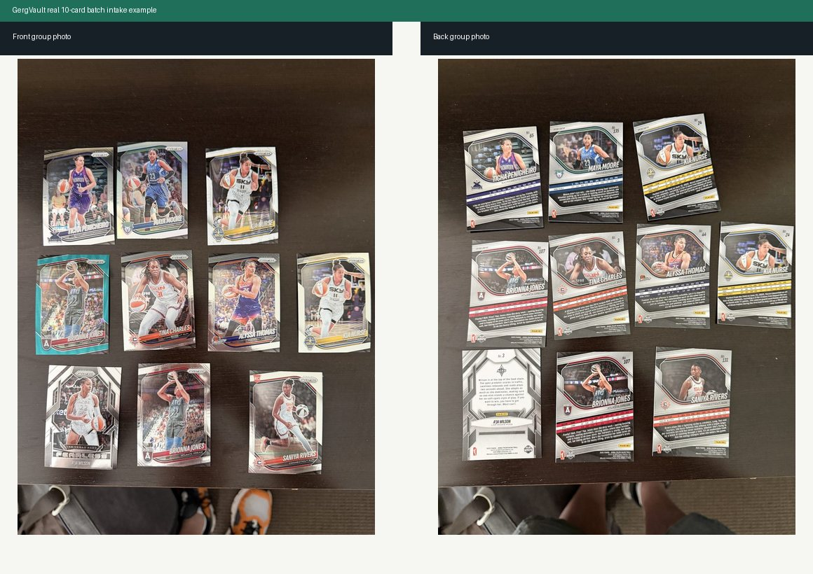

# GergVault

**Open-source trading card intake, review, AI extraction, and pricing intelligence.**

GergVault turns messy front/back group photos of trading cards into structured, reviewable card records. The first workflow is built for the real collector problem: lay out 10 cards, take one photo of the fronts and one photo of the backs, upload both, then review draft metadata before anything becomes part of the collection.

AI can help read the cards. Pricing providers can help estimate value. But GergVault is deliberately **human-review first**: no AI extraction, crop, or value estimate is treated as final until a person approves it.



The image above is a real front/back 10-card intake example used with permission. GergVault is designed for this kind of imperfect tabletop capture, not only pristine single-card scans.

## Why It Exists

Most card cataloging tools assume you already have clean single-card scans and typed metadata. Real intake is rougher than that. You open a pack, sort a stack, snap photos, and want the system to do the boring work without lying to you.

GergVault is built around that flow:

- upload batch front/back photos
- create draft card rows by slot position
- generate front/back crop records
- run optional AI extraction
- review and correct everything
- approve only when the data looks right
- add storage location and pricing intelligence over time

## Current Status

GergVault is an early open-source extraction from a working Django module. It is useful as a local/developer baseline today, with the most polished surface around 10-card batch intake and review.

Stable enough to explore:

- Django models, migrations, admin, API, and web views
- 10-card front/back batch intake
- review dashboard and card detail pages
- crop generation hooks
- OpenAI Vision extraction service hooks
- pricing intelligence provider architecture
- tests for intake, review, AI extraction, and pricing behavior

Still evolving:

- production packaging
- stronger provider integrations
- cleaner standalone UI polish
- hosted demo and demo video

## Features

- **Batch intake:** `batch_front_back` sessions for 10-card front/back group photos
- **Draft-first workflow:** every card starts as `needs_review`
- **Review UI:** dashboard, session review page, card detail page, editable metadata
- **Image records:** original front/back group images plus crop slots
- **AI extraction:** optional OpenAI Vision metadata extraction via `OPENAI_API_KEY`
- **Pricing intelligence:** optional Brave Search fallback and provider-ready valuation runs
- **Provider hooks:** eBay, PriceCharting/SportsCardsPro, PSA, manual comps
- **Management commands:** CLI paths for extraction, recropping, valuation, provider status
- **Privacy posture:** only permissioned demo images; no API keys, private uploads, or production data in the repo

## Tech Stack

- Python
- Django
- Django REST Framework
- SQLite by default, optional Postgres
- Pillow / OpenCV crop support
- OpenAI Vision integration
- Brave Search provider integration

## Quick Start

```bash
git clone https://github.com/gsavitch/GergVault.git
cd GergVault

cd backend
python -m venv .venv
.\.venv\Scripts\Activate.ps1
pip install -r requirements.txt
python manage.py migrate
python manage.py createsuperuser
python manage.py runserver
```

Open:

```text
http://127.0.0.1:8000/card-vault/
```

On macOS/Linux, activate the virtualenv with:

```bash
source .venv/bin/activate
```

## Docker Quick Start

```bash
docker compose up --build
```

Then open:

```text
http://127.0.0.1:8000/card-vault/
```

## Core Routes

| Route | Purpose |
| --- | --- |
| `/card-vault/` | Card Vault dashboard |
| `/card-vault/intake/<session_id>/review/` | Review a batch intake session |
| `/card-vault/cards/<card_id>/` | Card detail and enrichment actions |
| `/api/card-vault/intake/batch/` | Batch front/back intake API |

## Batch Intake API Shape

`POST /api/card-vault/intake/batch/`

Use multipart form data:

```text
front_group_image=<fronts photo>
back_group_image=<backs photo>
expected_card_count=10
sport=basketball
```

Each draft card follows this shape:

```json
{
  "slot_index": 1,
  "front_image_crop_id": null,
  "back_image_crop_id": null,
  "player_name": "",
  "team": "",
  "league": "",
  "sport": "basketball",
  "year": "",
  "brand": "",
  "product": "",
  "set_name": "",
  "card_number": "",
  "rookie_status": false,
  "insert_name": "",
  "parallel_name": "",
  "serial_number": "",
  "serial_total": "",
  "autograph_detected": false,
  "relic_detected": false,
  "patch_detected": false,
  "estimated_raw_value": null,
  "storage_recommendation": "",
  "confidence": 0,
  "review_status": "needs_review"
}
```

## Optional Provider Setup

GergVault runs without provider keys. Add keys only when you want extraction or pricing.

| Env var | Purpose | Required? |
| --- | --- | --- |
| `OPENAI_API_KEY` | Vision extraction and per-card enrichment | No |
| `OPENAI_CARD_VAULT_MODEL` | Optional model override | No |
| `BRAVE_SEARCH_API_KEY` | Search-result pricing discovery | No |
| `EBAY_CLIENT_ID` | Future eBay Browse API integration | No |
| `EBAY_CLIENT_SECRET` | Future eBay Browse API integration | No |
| `PRICECHARTING_API_KEY` | Future price-guide provider | No |
| `SPORTSCARDSPRO_API_KEY` | Future price-guide provider | No |
| `PSA_API_KEY` | Future population-report provider | No |

More detail: [`backend/card_vault/docs/pricing_provider_setup.md`](backend/card_vault/docs/pricing_provider_setup.md)

## Management Commands

From the repo root:

```bash
python backend/manage.py card_vault_extract_session <session_id>
python backend/manage.py card_vault_update_values <session_id>
python backend/manage.py card_vault_recrop_session <session_id>
python backend/manage.py card_vault_pricing_provider_status
```

Use `--dry-run` where supported to inspect work before writing changes.

## Verification

```bash
python backend/manage.py check
python -m compileall backend/card_vault
python backend/manage.py makemigrations card_vault --check --dry-run
python backend/manage.py test card_vault
```

Current local baseline: **32 tests passing**.

## Roadmap

- add a small synthetic demo image set
- improve standalone upload/review onboarding
- add screenshots and a short demo video
- make crop detection easier to tune per layout
- deepen eBay and price-guide integrations
- add export/import tools for collections
- package the app for easier reuse inside other Django projects

See [`docs/extraction_plan.md`](docs/extraction_plan.md) for the initial open-source extraction plan.

## Contributing

Issues, provider adapters, UI polish, docs, and test fixtures are all welcome. The useful rule of thumb: keep collector data private, keep AI output reviewable, and prefer clear confidence labels over fake certainty.

Start with:

- [`CONTRIBUTING.md`](CONTRIBUTING.md)
- [`SECURITY.md`](SECURITY.md)

## Data and Privacy

Do not commit production media, user uploads, API keys, or valuation results tied to a private collection. The example photos in `docs/assets/` are included with explicit permission as public demo material. Use synthetic examples under `examples/` for tests and non-permissioned demos.

## License

MIT. See [`LICENSE`](LICENSE).
